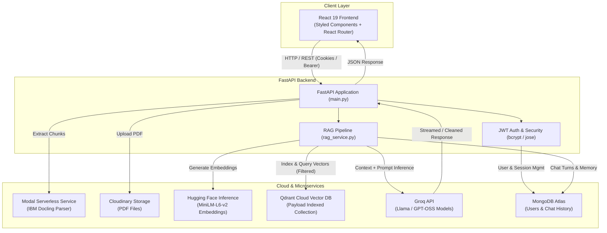

# 📄 DocuChat — Production-Grade Multi-Tenant PDF RAG Chatbot


**DocuChat** is a full-stack, multi-tenant Retrieval-Augmented Generation (RAG) conversational platform. It allows users to upload documents and engage in accurate, context-grounded, zero-hallucination chats powered by advanced document layout parsing, dense vector search, and ultra-fast LLM inference.

---

## 🌟 Key Features

- **⚡ Serverless Layout-Aware Document Parsing**: Offloads document understanding to **IBM Docling** hosted on **Modal**, extracting tables, structures, and semantic chunks without degrading backend performance.
- **🔒 Multi-Tenant User Authentication & Strict Isolation**:
  - Secure **JWT Authentication** with HTTP-only cookies and Bearer token support.
  - Password hashing with **Bcrypt**.
  - Strict data isolation across **MongoDB** and **Qdrant payload filters** (`user_id` + `session_id`).
- **🧠 Zero-Hallucination RAG Pipeline**:
  - Semantic embeddings generated via **Hugging Face Inference API** (`sentence-transformers/all-MiniLM-L6-v2`).
  - High-performance vector storage and Cosine similarity retrieval via **Qdrant Cloud**.
  - Ultra-fast responses powered by **Groq** (`openai/gpt-oss-120b` / customizable LLMs) with conversational memory and strict grounding prompts.
- **💾 Cloud Document & History Management**:
  - PDF cloud storage powered by **Cloudinary**.
  - Session history, user state, and multi-turn conversational memory persisted in **MongoDB Atlas**.
  - Cascading deletion: Deleting a session purges both MongoDB conversation logs and Qdrant vector points.
- **🎨 Sleek, Responsive React Interface**:
  - Built with **React 19**, **Styled Components**, and **React Router v7**.
  - Full Markdown rendering with syntax highlighting and formatting.
  - Sidebar with dynamic session lists, topic indicators, and quick-delete actions.

---

## 🏗️ System Architecture



---

## 📁 Repository Structure

```text
DOCUCHAT_TNS/
├── backend/                        # FastAPI Backend Application
│   ├── auth/                       # Authentication and User Management
│   │   ├── auth_router.py          # /auth endpoints (register, login, me, sessions)
│   │   ├── auth_service.py         # User registration & verification logic
│   │   ├── dependencies.py         # FastAPI dependency for authenticated current_user
│   │   ├── jwt_handler.py          # Token creation and verification (python-jose)
│   │   ├── models.py               # Pydantic schemas for auth requests
│   │   └── password_handler.py     # Bcrypt password hashing
│   ├── Rag/                        # Core RAG Logic
│   │   ├── embeddings.py           # HuggingFace custom LangChain Embeddings wrapper
│   │   └── rag_service.py          # Indexing, context retrieval, prompt construction & LLM invocation
│   ├── services/                   # External Service Integrations
│   │   ├── cloudinary_service.py   # Cloudinary PDF upload handler
│   │   ├── modal_service.py        # Client for the Docling Modal extraction endpoint
│   │   ├── mongodb.py              # MongoDB Atlas connection & session CRUD operations
│   │   └── qdrant_db_service.py    # Qdrant client, collection setup & payload filtering
│   ├── main.py                     # FastAPI entrypoint, CORS configuration & routes
│   └── requirements.txt            # Python backend dependencies
├── frontend/                       # React 19 Frontend Application
│   ├── public/                     # Public assets & index.html
│   ├── src/
│   │   ├── components/
│   │   │   ├── Chatpage/           # Main interactive chat interface & messaging UI
│   │   │   ├── HomePage/           # PDF upload screen & topic creation
│   │   │   ├── Loginpage/          # User login view
│   │   │   ├── Message/            # Markdown message rendering component
│   │   │   ├── Registerpage/       # User registration view
│   │   │   └── SideNavbar/         # Session history sidebar & session deletion
│   │   ├── api.js                  # Centralized API fetch helper with 401 handling
│   │   ├── App.js                  # Root application router & auth guard
│   │   ├── App.css                 # Global styling and loading spinner styles
│   │   └── index.js                # React application entry point
│   └── package.json                # Frontend scripts and dependencies
├── modal_service/                  # Modal Serverless Docling Parser
│   ├── docling_service/
│   │   ├── documents_reader.py     # LangChain Docling document loader
│   │   └── serializer.py           # Document chunk serializer
│   ├── app.py                      # Modal App definition and FastAPI endpoint
│   └── requirements.txt            # Dependencies for the Modal container
├── example.env                     # Template environment variables
└── README.md                       # Project documentation
```

---

## ⚙️ Prerequisites

Ensure you have the following installed on your machine:

- **Python**: `3.10+`
- **Node.js**: `18.x` or `20.x+` and `npm`
- **Accounts & API Keys**:
  - [Groq Cloud](https://console.groq.com/) (for LLM inference)
  - [Hugging Face](https://huggingface.co/) (Inference token for embeddings)
  - [MongoDB Atlas](https://www.mongodb.com/cloud/atlas) (Cluster URI)
  - [Qdrant Cloud](https://cloud.qdrant.io/) (Cluster URL and API Key)
  - [Cloudinary](https://cloudinary.com/) (Cloud Name, API Key, API Secret)
  - [Modal](https://modal.com/) (for deploying the Docling parsing service)

---

## 🔑 Environment Variables Configuration

Create a `.env` file inside the `backend/` directory (or workspace root) based on `example.env`:

```env
# =========================================================
# DocuChat - Environment Variables
# =========================================================

# Groq API
GROQ_API_KEY=your_groq_api_key

# Hugging Face
HF_TOKEN=your_huggingface_token

# MongoDB Atlas
MONGODB_URI=mongodb+srv://<username>:<password>@<cluster-name>.mongodb.net/?retryWrites=true&w=majority&appName=<app-name>

# Cloudinary
CLOUDINARY_CLOUD_NAME=your_cloudinary_cloud_name
CLOUDINARY_API_KEY=your_cloudinary_api_key
CLOUDINARY_API_SECRET=your_cloudinary_api_secret

# Modal Docling Service URL
MODAL_URL=https://<your-modal-workspace>--docuchat-docling-extract-documents.modal.run

# Authentication & Security
SECRET_KEY=your_super_secret_random_key
ALGORITHM=HS256
ACCESS_TOKEN_EXPIRE_MINUTES=2880
IS_PRODUCTION=false

# Vector DB - Qdrant Cloud
QDRANT_URL=https://<your-cluster-id>.aws.cloud.qdrant.io
QDRANT_API_KEY=your_qdrant_api_key
```

### Frontend Environment (Optional)
If deploying or targeting a non-default backend URL, create a `.env` in `frontend/`:
```env
REACT_APP_API_URL=http://localhost:8000
```

---

## 🚀 Getting Started

### 1. Deploy the Modal Docling Service

DocuChat uses IBM Docling in a serverless Modal container to parse complex documents.

```bash
cd modal_service

# Install Modal CLI and authenticate
pip install modal
modal setup

# Deploy the microservice
modal deploy app.py
```
> **Note**: Copy the deployed URL and assign it to `MODAL_URL` in your backend `.env`.

---

### 2. Backend Setup & Run

1. Navigate to the backend directory:
   ```bash
   cd backend
   ```
2. Create and activate a Python virtual environment:
   ```bash
   # Windows (PowerShell)
   python -m venv venv
   .\venv\Scripts\Activate.ps1

   # Linux / macOS
   python3 -m venv venv
   source venv/bin/activate
   ```
3. Install required dependencies:
   ```bash
   pip install -r requirements.txt
   ```
4. Start the FastAPI development server:
   ```bash
   uvicorn main:app --reload --port 8000
   ```
   The backend will be live at `http://localhost:8000`. You can test the API docs at `http://localhost:8000/docs`.

---

### 3. Frontend Setup & Run

1. Navigate to the frontend directory:
   ```bash
   cd frontend
   ```
2. Install npm packages:
   ```bash
   npm install
   ```
3. Start the React development server:
   ```bash
   npm start
   ```
   The application will automatically open at `http://localhost:3000`.

---

## 📡 API Reference

### 🔐 Authentication Endpoints (`/auth`)

| Method | Endpoint | Description | Auth Required |
| :--- | :--- | :--- | :--- |
| `POST` | `/auth/register` | Register a new user account | ❌ No |
| `POST` | `/auth/login` | Authenticate user and set HTTP-only JWT cookie | ❌ No |
| `GET` | `/auth/me` | Retrieve currently authenticated user profile | ✅ Yes |
| `POST` | `/auth/logout` | Clear auth cookie and terminate session | ❌ No |
| `GET` | `/auth/sessions` | Fetch all chat sessions for the authenticated user | ✅ Yes |
| `GET` | `/auth/session/{session_id}` | Load full message history of a specific session | ✅ Yes |
| `DELETE` | `/auth/session/{session_id}` | Delete a session, its MongoDB history, and Qdrant vectors | ✅ Yes |

### 💬 Document Processing & Chat Endpoints

| Method | Endpoint | Description | Auth Required |
| :--- | :--- | :--- | :--- |
| `GET` | `/` | Health check endpoint | ❌ No |
| `POST` | `/process/{topic}` | Upload a PDF (`multipart/form-data`), extract chunks via Modal, store in Cloudinary, index in Qdrant, and start a new session | ✅ Yes |
| `POST` | `/response` | Send a query string to an existing session for context retrieval and LLM response | ✅ Yes |

---

## 🔄 RAG Lifecycle & Data Flow

1. **Upload & Storage**: User uploads a PDF with a topic name on the frontend. The file is streamed to the backend, uploaded to Cloudinary, and saved in a temporary local buffer.
2. **Docling Layout Analysis**: The backend sends the document bytes to the **Modal Docling Service**, which performs structural parsing and chunk extraction.
3. **Recursive Splitting & Metadata Tagging**: Chunks are split using `RecursiveCharacterTextSplitter` (1000 char size / 200 char overlap) and enriched with `{ user_id, session_id, topic_name }`.
4. **Vector Embedding & Indexing**: Chunks are transformed into vector embeddings via `HFEmbedding` and persisted into the **Qdrant** collection `docuchat_documents`.
5. **Filtered Context Retrieval**: When a query is made, Qdrant performs a similarity search filtered strictly by the user's `user_id` and `session_id`.
6. **LLM Synthesis**: The retrieved chunks and the recent conversation turns (last 3 turns from MongoDB) are formatted into a grounded system prompt and sent to **Groq**.
7. **Persistence**: The resulting answer and user query are atomically appended to MongoDB Atlas under the active `session_id`.

---

## 🛡️ Security & Best Practices

- **Zero Data Leakage**: Qdrant queries enforce payload match conditions on `metadata.user_id` and `metadata.session_id`. No user can query or access vector embeddings belonging to another user.
- **Secure Cookies**: In production (`IS_PRODUCTION=true`), authentication cookies are issued with `Secure=True` and `SameSite=None` for secure cross-origin communication.
- **Clean Vector Cleanup**: When a chat session is deleted, vectors associated with that session are purged from Qdrant via points selector filtering.

---

## 🤝 Contributing

Contributions, issues, and feature requests are welcome!
1. Fork the repository
2. Create your feature branch (`git checkout -b feature/AmazingFeature`)
3. Commit your changes (`git commit -m 'Add some AmazingFeature'`)
4. Push to the branch (`git push origin feature/AmazingFeature`)
5. Open a Pull Request


